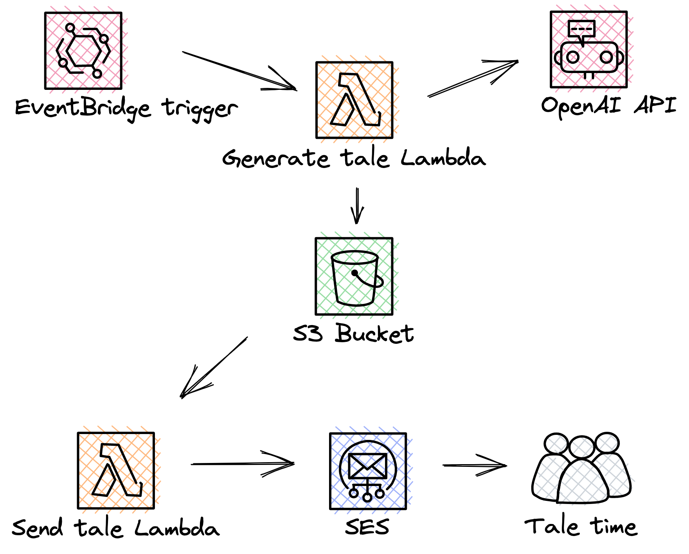

# :books: T~~ai~~l time 

A fun wee project that creates bedtime tales using [OpenAI](https://openai.com/) and sends those tales onwards to one's reading device of choice, for example a Kindle via email.

A very much WIP and hobby project.

I plan to make this into a usable service that would publish the generated tales for all to enjoy, however until that time, this project can easily be forked and modified to fit your own needs.

## Background

I love reading to my kids. I love technology. Why not mix the two together and have some fun.

## Architecture

This solution is :100: overkill, and could be done in far simpler ways, but what would be the fun be in that!

 
However, the implemented and deployed microservice architecture does provide advantages over a more monolith counterpart such as:

- Increased resilience should one part of the pipeline fail.
- Easier testing, debugging and local development.
- Faster and easier future development / maintenance.
- Single and clear responsibilities of the service implementations. 
- Improved scalability should that time ever come.

All services are written in [Go](https://go.dev/).

The infrastructure is provisioned with [Terraform](https://www.terraform.io/) and deployed to [AWS](https://aws.amazon.com/) and runs fully in the [free tier](https://aws.amazon.com/free).

## Development

### Prerequisites

- Install [Go 1.23.6](https://go.dev/doc/install)

### Setup the environment

Copy and configure `.env.sample` to `.env`. It will be read at run time by the Go code.

### Install dependencies

`go mod download` to download all the Go dependencies.

### Run local version

`go run cmd/tail-time-generate-text-demo/main.go` to run a local version which creates a tale and logs it out.

### Deployment

See the [Terraform documentation](./infra/terraform/README.md).

## Up next...

Many things in the roadmap but here are a few:

- Allow the pipeline to be invoked by an Alexa custom skill.
- Build a prompt flow to validate, improve and augment the tale.  
- Build a larger tale consisting of chapters covering various topics.
- Present tales generated to the public for access and usage.
- Augment the tale with imaginary.