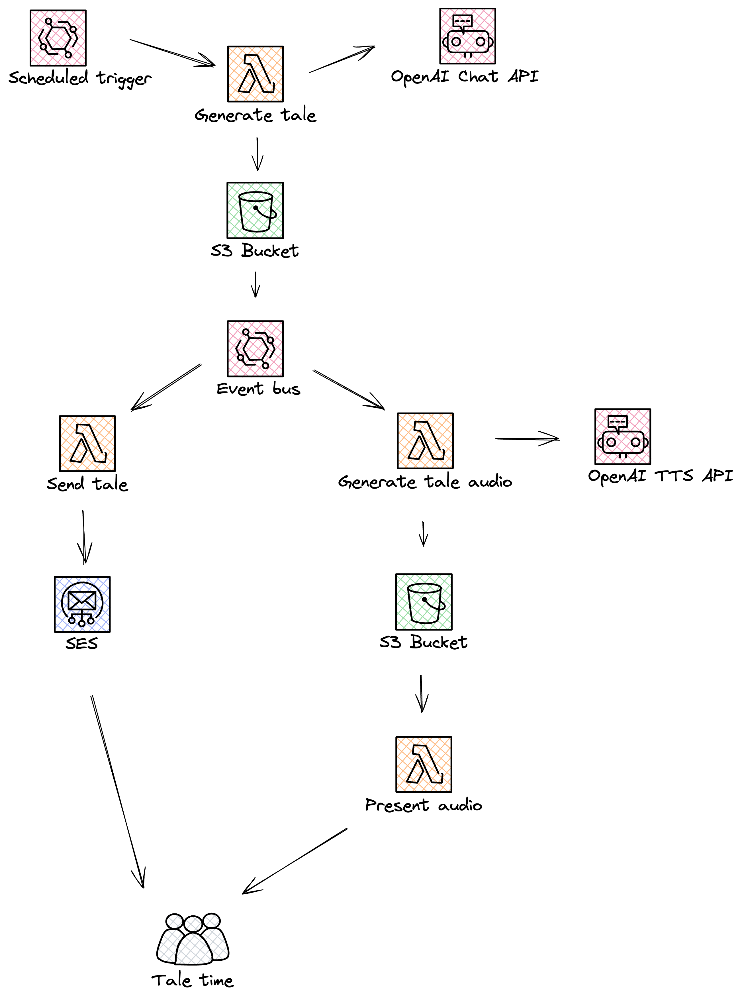

# T~~ai~~l time

A fun wee project that creates bedtime tales using [OpenAI](https://openai.com/) and sends those tales onwards to one's reading device, for example a Kindle via email.

A very much WIP project.

The current goal was not to make a public service out of this, but rather make something useful to my personal needs. I plan to make this into a usable service that would publish the generated tales for all to access, however until that time, this project can easily be forked and modified to fit your own needs. Enjoy!

## Background

I love reading to my kids. I love technology. I had an idea to mix these two together and had some fun.

## Architecture

This solution is :100: overkill, and could be done in far simpler ways, even in a single small script, but what would be the fun be in that!

 
However, the proposed and deployed architecture does provide advantages over its monolith counterpart such as:

- Increased resilience should one part of the pipeline fail
- Easier testing, debugging and local development
- Easier and isolated deployments
- Single responsibilities of the service implementations 
- Improved scalability should that time ever come
- Easier future development / maintenance

All services are written in [Go](https://go.dev/).

The infrastructure is provisioned with [Terraform](https://www.terraform.io/) and deployed to [AWS](https://aws.amazon.com/) and runs fully in the [free tier](https://aws.amazon.com/free).

## Development

Coming soon.

## Up next...

Many things in the roadmap but here are a few:

- Experiment and explore different prompts and models. 
  - Many of the updated models are often inaccessible due to traffic.
- Feed to the tale back into OpenAI for validation and improvements.
- Build a larger tale consisting of chapters covering various topics.
- Allow the pipeline to be invoked by an Alexa custom skill.
- Present tales generated to the public for access and usage.
- Augment the tale with generated imaginary 
- Present the tale in prettier formats ie PDFs
